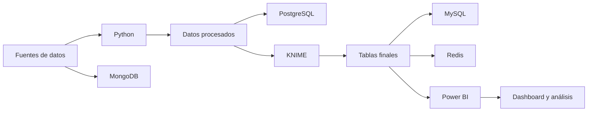

# Análisis de Accidentes de Tránsito en Ecuador

Proyecto de análisis de datos enfocado en el procesamiento, integración y visualización de información sobre siniestros de tránsito ocurridos en Ecuador.

El proyecto implementa un proceso completo de extracción, transformación y carga de datos utilizando Python y KNIME. Además, emplea diferentes bases de datos para almacenar la información y Power BI para construir un dashboard interactivo.

## Integrantes

- Sebastian Toapanta
- Alisson Quiguango

## Objetivo

Analizar los siniestros de tránsito registrados en Ecuador durante 2019 para identificar patrones territoriales, temporales y de severidad.

El análisis considera variables como:

- Provincia y cantón.
- Mes y día de la semana.
- Franja horaria.
- Clase y causa del siniestro.
- Fallecidos y lesionados.
- Población.
- Vehículos matriculados.
- Temperatura y precipitación.

## Tecnologías utilizadas

| Tecnología | Uso |
|---|---|
| Python | Carga, limpieza, transformación, validación y análisis exploratorio |
| Pandas | Procesamiento y manipulación de datos |
| Jupyter Notebook | Desarrollo del proceso de limpieza y EDA |
| KNIME | Construcción del modelo dimensional y proceso ETL |
| MongoDB | Respaldo de los datos originales |
| PostgreSQL | Almacenamiento de los datos procesados |
| MySQL | Almacenamiento de las tablas finales |
| Redis | Almacenamiento de indicadores y consultas rápidas |
| Power BI | Modelo de datos, medidas DAX y dashboard |
| GitHub | Control de versiones y trabajo colaborativo |

## Arquitectura del proyecto



El proceso desarrollado fue el siguiente:

1. Extracción de los archivos originales.
2. Limpieza y transformación mediante Python.
3. Validación de la calidad de los datos.
4. Desarrollo del análisis exploratorio.
5. Respaldo de los datos originales en MongoDB.
6. Almacenamiento de los datos procesados en PostgreSQL.
7. Transformación y creación del modelo dimensional en KNIME.
8. Almacenamiento de las tablas finales en MySQL.
9. Almacenamiento de indicadores en Redis.
10. Creación del modelo, medidas DAX y dashboard en Power BI.

## Fuentes de datos

Se utilizaron datos relacionados con:

- Siniestros de tránsito de 2019.
- Vehículos matriculados durante 2019.
- Fallecidos registrados por el SPPAT.
- Población del Censo 2022.
- Temperatura registrada durante 2019.
- Precipitación registrada durante 2019.

## Proceso realizado en Python

En Python se desarrollaron las siguientes actividades:

- Lectura de archivos CSV y Excel.
- Normalización de nombres de columnas.
- Limpieza y estandarización de textos.
- Conversión de columnas numéricas.
- Conversión y validación de fechas.
- Tratamiento de valores faltantes.
- Eliminación y análisis de duplicados.
- Creación de variables temporales.
- Creación de la franja horaria.
- Validación de la calidad antes y después de la limpieza.
- Análisis exploratorio de datos.
- Exportación de los archivos procesados.

## Archivos procesados

Los archivos generados en `data/processed/` son:

```text
fallecidos_sppat_2019_limpio.csv
poblacion_censo_2022_limpia.csv
precipitacion_2019_limpia.csv
siniestros_2019_limpio.csv
temperatura_2019_limpia.csv
vehiculos_matriculados_2019_limpio.csv
```

## Proceso ETL en KNIME

KNIME recibió los archivos procesados y realizó operaciones como:

- Selección de columnas.
- Eliminación de duplicados.
- Estandarización de textos.
- Tratamiento de valores faltantes.
- Agrupación de registros.
- Generación de identificadores.
- Integración de tablas mediante Joiner.
- Exportación de las dimensiones y tabla de hechos.
- Carga de resultados en MySQL.

## Modelo dimensional

El proceso de KNIME generó las siguientes tablas finales:

```text
fact_siniestros.csv
dim_fecha.csv
dim_ubicacion.csv
dim_clima.csv
dim_vehiculo.csv
dim_poblacion.csv
```

### Tabla de hechos

`fact_siniestros` contiene los registros principales de los siniestros y sus métricas:

- Número de fallecidos.
- Número de lesionados.
- Total de víctimas.
- Clase del siniestro.
- Causa del siniestro.
- Franja horaria.
- Identificadores de fecha y ubicación.

### Dimensiones

| Dimensión | Contenido |
|---|---|
| `dim_fecha` | Año, mes y día de la semana |
| `dim_ubicacion` | Provincia, cantón y zona |
| `dim_clima` | Estación, temperatura y precipitación |
| `dim_vehiculo` | Vehículos matriculados por provincia |
| `dim_poblacion` | Población y densidad poblacional |

## Bases de datos

### MongoDB

Se utilizó MongoDB para almacenar un respaldo de los datos originales o `raw`, conservando la información antes de las transformaciones.

### PostgreSQL

PostgreSQL almacena los seis archivos procesados dentro del esquema de preparación o `staging`.

### MySQL

MySQL almacena las dimensiones y la tabla de hechos generadas por KNIME.

### Redis

Redis se utilizó para almacenar indicadores y facilitar el acceso rápido a resultados resumidos.

## Dashboard en Power BI

Los archivos finales fueron importados en Power BI para construir el modelo analítico.

Se configuraron:

- Relaciones uno a varios.
- Dirección de filtro única.
- Dimensión auxiliar de periodo.
- Dimensión auxiliar de cantón.
- Dimensión auxiliar de franja horaria.
- Ordenamiento de meses y días.
- Segmentadores interactivos.
- Indicadores mediante medidas DAX.

## Medidas DAX principales

Entre las medidas desarrolladas se encuentran:

- Total de siniestros.
- Total de fallecidos.
- Total de lesionados.
- Total de víctimas.
- Promedio de víctimas por siniestro.
- Tasa de mortalidad.
- Temperatura promedio.
- Precipitación promedio.
- Población total.
- Densidad promedio.
- Total de vehículos matriculados.
- Siniestros por cada 100.000 habitantes.
- Fallecidos por cada 100.000 habitantes.
- Siniestros por cada 10.000 vehículos.

## Páginas del dashboard

El dashboard contiene cuatro páginas:

### 1. Resumen general

Presenta:

- Total de siniestros.
- Total de fallecidos.
- Total de lesionados.
- Total de víctimas.
- Accidentes por provincia.
- Mapa de distribución geográfica.
- Filtros de provincia, mes y clase.

### 2. Análisis de accidentes

Incluye:

- Principales causas.
- Distribución por clase.
- Accidentes por franja horaria.

### 3. Factores asociados

Analiza:

- Temperatura y precipitación mensual.
- Población por provincia.
- Vehículos matriculados por provincia.
- Indicadores ajustados por población y vehículos.

### 4. Análisis temporal y severidad

Presenta:

- Evolución mensual de siniestros.
- Siniestros por día de la semana.
- Fallecidos y lesionados por provincia.
- Tasa de mortalidad.
- Indicadores de riesgo.

## Estructura del repositorio

```text
proyecto-accidentes-transito/
├── data/
│   ├── raw/
│   ├── processed/
│   └── final/
├── databases/
│   ├── mongodb/
│   ├── mysql/
│   ├── postgresql/
│   └── redis/
├── docs/
├── knime/
├── notebooks/
├── powerbi/
├── scripts/
├── requirements.txt
└── README.md
```

## Ejecución del proyecto

### 1. Clonar el repositorio

```bash
git clone URL_DEL_REPOSITORIO
cd proyecto-accidentes-transito
```

### 2. Instalar las dependencias

```bash
pip install -r requirements.txt
```

### 3. Ejecutar los notebooks

Abrir Jupyter Notebook:

```bash
jupyter notebook
```

Ejecutar los notebooks en el orden establecido dentro de `notebooks/`.

### 4. Ejecutar KNIME

Abrir el workflow almacenado en `knime/` y actualizar las rutas de los archivos de entrada y salida según el equipo local.

### 5. Configurar las bases de datos

Ejecutar los scripts correspondientes ubicados en:

```text
databases/mongodb/
databases/mysql/
databases/postgresql/
databases/redis/
```

### 6. Abrir el dashboard

Abrir el archivo `.pbix` almacenado en:

```text
powerbi/
```

## Videos y publicación

Los enlaces de los videos explicativos y la publicación interactiva de Power BI se encuentran en:

```text
docs/enlaces_proyecto.txt
```

Los videos corresponden a:

1. Proceso de datos y ETL.
2. Análisis del dashboard y conclusiones.

## Consideraciones

- Las rutas configuradas en KNIME deben actualizarse cuando el workflow se ejecute en otro equipo.
- Las credenciales de las bases de datos no se incluyen en el repositorio.
- Los archivos originales de gran tamaño pueden requerir almacenamiento externo o Git LFS.
- El enlace público de Power BI debe utilizarse únicamente con información que pueda ser compartida públicamente.

## Autores

**Sebastian Toapanta**  
**Alisson Quiguango**

Proyecto académico de análisis de datos.
